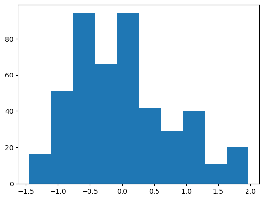
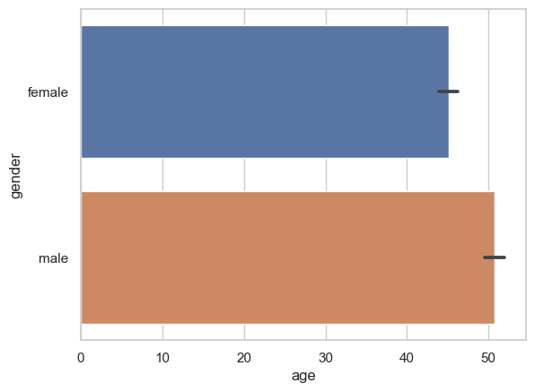
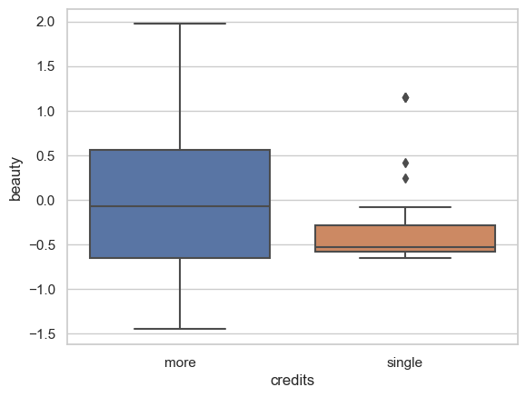
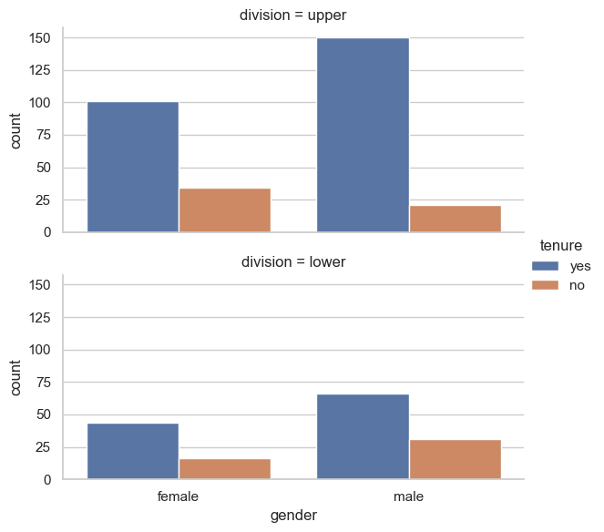

# 5. Estadística básica con Pandas

Haremos un ejemplo básico usando numpy, pandas y matplotlib.


```python
import numpy as np
import pandas as pd
import matplotlib.pyplot as pyplot
```

Y cargamos la base de datos que se encuentra en una página web.


```python
URL = 'https://cf-courses-data.s3.us.cloud-object-storage.appdomain.cloud/IBMDeveloperSkillsNetwork-ST0151EN-SkillsNetwork/labs/teachingratings.csv'
```


```python
base=pd.read_csv(URL)
```

### 1. Información de la base de datos


```python
# a. Para ver los primeros datos:

base.head()
```


<div>
<style scoped>
    .dataframe tbody tr th:only-of-type {
        vertical-align: middle;
    }

    .dataframe tbody tr th {
        vertical-align: top;
    }

    .dataframe thead th {
        text-align: right;
    }
</style>
<table border="1" class="dataframe">
  <thead>
    <tr style="text-align: right;">
      <th></th>
      <th>minority</th>
      <th>age</th>
      <th>gender</th>
      <th>credits</th>
      <th>beauty</th>
      <th>eval</th>
      <th>division</th>
      <th>native</th>
      <th>tenure</th>
      <th>students</th>
      <th>allstudents</th>
      <th>prof</th>
      <th>PrimaryLast</th>
      <th>vismin</th>
      <th>female</th>
      <th>single_credit</th>
      <th>upper_division</th>
      <th>English_speaker</th>
      <th>tenured_prof</th>
    </tr>
  </thead>
  <tbody>
    <tr>
      <th>0</th>
      <td>yes</td>
      <td>36</td>
      <td>female</td>
      <td>more</td>
      <td>0.289916</td>
      <td>4.3</td>
      <td>upper</td>
      <td>yes</td>
      <td>yes</td>
      <td>24</td>
      <td>43</td>
      <td>1</td>
      <td>0</td>
      <td>1</td>
      <td>1</td>
      <td>0</td>
      <td>1</td>
      <td>1</td>
      <td>1</td>
    </tr>
    <tr>
      <th>1</th>
      <td>yes</td>
      <td>36</td>
      <td>female</td>
      <td>more</td>
      <td>0.289916</td>
      <td>3.7</td>
      <td>upper</td>
      <td>yes</td>
      <td>yes</td>
      <td>86</td>
      <td>125</td>
      <td>1</td>
      <td>0</td>
      <td>1</td>
      <td>1</td>
      <td>0</td>
      <td>1</td>
      <td>1</td>
      <td>1</td>
    </tr>
    <tr>
      <th>2</th>
      <td>yes</td>
      <td>36</td>
      <td>female</td>
      <td>more</td>
      <td>0.289916</td>
      <td>3.6</td>
      <td>upper</td>
      <td>yes</td>
      <td>yes</td>
      <td>76</td>
      <td>125</td>
      <td>1</td>
      <td>0</td>
      <td>1</td>
      <td>1</td>
      <td>0</td>
      <td>1</td>
      <td>1</td>
      <td>1</td>
    </tr>
    <tr>
      <th>3</th>
      <td>yes</td>
      <td>36</td>
      <td>female</td>
      <td>more</td>
      <td>0.289916</td>
      <td>4.4</td>
      <td>upper</td>
      <td>yes</td>
      <td>yes</td>
      <td>77</td>
      <td>123</td>
      <td>1</td>
      <td>1</td>
      <td>1</td>
      <td>1</td>
      <td>0</td>
      <td>1</td>
      <td>1</td>
      <td>1</td>
    </tr>
    <tr>
      <th>4</th>
      <td>no</td>
      <td>59</td>
      <td>male</td>
      <td>more</td>
      <td>-0.737732</td>
      <td>4.5</td>
      <td>upper</td>
      <td>yes</td>
      <td>yes</td>
      <td>17</td>
      <td>20</td>
      <td>2</td>
      <td>0</td>
      <td>0</td>
      <td>0</td>
      <td>0</td>
      <td>1</td>
      <td>1</td>
      <td>1</td>
    </tr>
  </tbody>
</table>
</div>


```python
# b. Para conocer información de cada variable:

base.info()
```

    <class 'pandas.core.frame.DataFrame'>
    RangeIndex: 463 entries, 0 to 462
    Data columns (total 19 columns):
     #   Column           Non-Null Count  Dtype  
    ---  ------           --------------  -----  
     0   minority         463 non-null    object 
     1   age              463 non-null    int64  
     2   gender           463 non-null    object 
     3   credits          463 non-null    object 
     4   beauty           463 non-null    float64
     5   eval             463 non-null    float64
     6   division         463 non-null    object 
     7   native           463 non-null    object 
     8   tenure           463 non-null    object 
     9   students         463 non-null    int64  
     10  allstudents      463 non-null    int64  
     11  prof             463 non-null    int64  
     12  PrimaryLast      463 non-null    int64  
     13  vismin           463 non-null    int64  
     14  female           463 non-null    int64  
     15  single_credit    463 non-null    int64  
     16  upper_division   463 non-null    int64  
     17  English_speaker  463 non-null    int64  
     18  tenured_prof     463 non-null    int64  
    dtypes: float64(2), int64(11), object(6)
    memory usage: 68.9+ KB
    

Es importante recordar que:

- La población son todos los elementos de interés para una decisión o investigación. El tamaño de la población se representa con *N*.
- Una muestra es una parte de la población. El tamaño de la muestra se representa con *n*.
- El número de observaciones en una celda *i* de una distribución de frecuencia es *f*.


```python
# c. Para saber número de filas y de columnas (en ese orden):

base.shape
```


    (463, 19)


### 2. Medidas de tendencia central

##### 1. Media 

La media se refiere a la suma de todas las observaciones dividida entre el número de observaciones.

Algunas de sus propiedades son:

- Es relevante para variables continuas.
- Es afectada por observaciones inusualmente grandes o pequeñas, es decir, los outliers.
- Es la única medida de tendencia central donde la suma de las desviaciones de cada valor respecto a la media es cero.
- Representa a todo el conjunto de datos, ya que toma en cuenta todos los valores para su cálculo, proporcionando una medida central útil para comparaciones y análisis posteriores.


```python
# Escogemos una columna numérica para obtener su media, la cual va entre corchetes:

base["students"].mean()
```


    36.62419006479482


##### 2. Mediana

La mediana es el valor medio cuando los datos se ordenan del menor al mayor, lo que resulta en un número igual de observaciones por arriba y debajo de la mediana.

Algunas de sus propiedades son:

- Es única para cada conjunto de datos.
- No es afectada por outliers.
- Es relevante para datos ordinales, de radios e intervalos.


```python
# De igual manera escogemos una columna para calcular la mediana:

base["students"].median()
```


    23.0


##### 3. Máximos y mínimos


```python
base["students"].max()
```


    380


```python
base["students"].min()
```


    5


### 3. Tabla de estadística descriptiva e histograma

Usaremos la función **describe()** para obtener más información, como desviación estándar y percentiles.


```python
base.describe()
```


<div>
<style scoped>
    .dataframe tbody tr th:only-of-type {
        vertical-align: middle;
    }

    .dataframe tbody tr th {
        vertical-align: top;
    }

    .dataframe thead th {
        text-align: right;
    }
</style>
<table border="1" class="dataframe">
  <thead>
    <tr style="text-align: right;">
      <th></th>
      <th>age</th>
      <th>beauty</th>
      <th>eval</th>
      <th>students</th>
      <th>allstudents</th>
      <th>prof</th>
      <th>PrimaryLast</th>
      <th>vismin</th>
      <th>female</th>
      <th>single_credit</th>
      <th>upper_division</th>
      <th>English_speaker</th>
      <th>tenured_prof</th>
    </tr>
  </thead>
  <tbody>
    <tr>
      <th>count</th>
      <td>463.000000</td>
      <td>4.630000e+02</td>
      <td>463.000000</td>
      <td>463.000000</td>
      <td>463.000000</td>
      <td>463.000000</td>
      <td>463.000000</td>
      <td>463.000000</td>
      <td>463.000000</td>
      <td>463.000000</td>
      <td>463.000000</td>
      <td>463.000000</td>
      <td>463.000000</td>
    </tr>
    <tr>
      <th>mean</th>
      <td>48.365011</td>
      <td>6.271140e-08</td>
      <td>3.998272</td>
      <td>36.624190</td>
      <td>55.177106</td>
      <td>45.434125</td>
      <td>0.203024</td>
      <td>0.138229</td>
      <td>0.421166</td>
      <td>0.058315</td>
      <td>0.660907</td>
      <td>0.939525</td>
      <td>0.779698</td>
    </tr>
    <tr>
      <th>std</th>
      <td>9.802742</td>
      <td>7.886477e-01</td>
      <td>0.554866</td>
      <td>45.018481</td>
      <td>75.072800</td>
      <td>27.508902</td>
      <td>0.402685</td>
      <td>0.345513</td>
      <td>0.494280</td>
      <td>0.234592</td>
      <td>0.473913</td>
      <td>0.238623</td>
      <td>0.414899</td>
    </tr>
    <tr>
      <th>min</th>
      <td>29.000000</td>
      <td>-1.450494e+00</td>
      <td>2.100000</td>
      <td>5.000000</td>
      <td>8.000000</td>
      <td>1.000000</td>
      <td>0.000000</td>
      <td>0.000000</td>
      <td>0.000000</td>
      <td>0.000000</td>
      <td>0.000000</td>
      <td>0.000000</td>
      <td>0.000000</td>
    </tr>
    <tr>
      <th>25%</th>
      <td>42.000000</td>
      <td>-6.562689e-01</td>
      <td>3.600000</td>
      <td>15.000000</td>
      <td>19.000000</td>
      <td>20.000000</td>
      <td>0.000000</td>
      <td>0.000000</td>
      <td>0.000000</td>
      <td>0.000000</td>
      <td>0.000000</td>
      <td>1.000000</td>
      <td>1.000000</td>
    </tr>
    <tr>
      <th>50%</th>
      <td>48.000000</td>
      <td>-6.801430e-02</td>
      <td>4.000000</td>
      <td>23.000000</td>
      <td>29.000000</td>
      <td>44.000000</td>
      <td>0.000000</td>
      <td>0.000000</td>
      <td>0.000000</td>
      <td>0.000000</td>
      <td>1.000000</td>
      <td>1.000000</td>
      <td>1.000000</td>
    </tr>
    <tr>
      <th>75%</th>
      <td>57.000000</td>
      <td>5.456024e-01</td>
      <td>4.400000</td>
      <td>40.000000</td>
      <td>60.000000</td>
      <td>70.500000</td>
      <td>0.000000</td>
      <td>0.000000</td>
      <td>1.000000</td>
      <td>0.000000</td>
      <td>1.000000</td>
      <td>1.000000</td>
      <td>1.000000</td>
    </tr>
    <tr>
      <th>max</th>
      <td>73.000000</td>
      <td>1.970023e+00</td>
      <td>5.000000</td>
      <td>380.000000</td>
      <td>581.000000</td>
      <td>94.000000</td>
      <td>1.000000</td>
      <td>1.000000</td>
      <td>1.000000</td>
      <td>1.000000</td>
      <td>1.000000</td>
      <td>1.000000</td>
      <td>1.000000</td>
    </tr>
  </tbody>
</table>
</div>


```python
# Para el histograma:

# 1. Escribir o llamar a la librería
# 2. Escribir seguido de un punto, la función a utilizar
# 3. Dentro de la función, especificamos los datos a graficar: la base y la columna

pyplot.hist(base["beauty"])
```


    (array([16., 51., 94., 66., 94., 42., 29., 40., 11., 20.]),
     array([-1.45049405, -1.10844234, -0.76639063, -0.42433892, -0.08228722,
             0.25976449,  0.6018162 ,  0.94386791,  1.28591962,  1.62797133,
             1.97002304]),
     <BarContainer object of 10 artists>)


    

    


#### Ejercicios

1. Calcula los promedios y desviación estándar por género de los instructores. Para ello, agrupa por género. Es necesario usar las funciones **groupby()**, **agg()** y **reset_index()**. Nota: **agg** se usa para aplicar múltiples funciones de agregación a un DataFrame. 


```python
base.groupby('gender').agg({'beauty':['mean', 'std', 'var']}).reset_index()
```


<div>
<style scoped>
    .dataframe tbody tr th:only-of-type {
        vertical-align: middle;
    }

    .dataframe tbody tr th {
        vertical-align: top;
    }

    .dataframe thead tr th {
        text-align: left;
    }
</style>
<table border="1" class="dataframe">
  <thead>
    <tr>
      <th></th>
      <th>gender</th>
      <th colspan="3" halign="left">beauty</th>
    </tr>
    <tr>
      <th></th>
      <th></th>
      <th>mean</th>
      <th>std</th>
      <th>var</th>
    </tr>
  </thead>
  <tbody>
    <tr>
      <th>0</th>
      <td>female</td>
      <td>0.116109</td>
      <td>0.81781</td>
      <td>0.668813</td>
    </tr>
    <tr>
      <th>1</th>
      <td>male</td>
      <td>-0.084482</td>
      <td>0.75713</td>
      <td>0.573246</td>
    </tr>
  </tbody>
</table>
</div>


2. Calcula el porcentaje de hombres y mujeres que son profesores titulares. Es necesario usar las funciones de filtrado, **groupby()**, **agg()**, **reset_index()** y **sum()**.


```python
# Primero es necesario crear una nueva tabla donde filtremos a los profesores que sí son titulares:

titulares = base[base.tenure == "yes"].groupby("gender").agg({"tenure":"count"}).reset_index()

titulares
```


<div>
<style scoped>
    .dataframe tbody tr th:only-of-type {
        vertical-align: middle;
    }

    .dataframe tbody tr th {
        vertical-align: top;
    }

    .dataframe thead th {
        text-align: right;
    }
</style>
<table border="1" class="dataframe">
  <thead>
    <tr style="text-align: right;">
      <th></th>
      <th>gender</th>
      <th>tenure</th>
    </tr>
  </thead>
  <tbody>
    <tr>
      <th>0</th>
      <td>female</td>
      <td>145</td>
    </tr>
    <tr>
      <th>1</th>
      <td>male</td>
      <td>216</td>
    </tr>
  </tbody>
</table>
</div>


```python
# Ahora añadimos el porcentaje, que será una nueva columna:
# Porcentaje = (cantidad de titulares (por #mujer y #hombre) / suma de titulares) * 100

titulares["porcentaje"] = titulares.tenure/titulares.tenure.sum() * 100

titulares

```


<div>
<style scoped>
    .dataframe tbody tr th:only-of-type {
        vertical-align: middle;
    }

    .dataframe tbody tr th {
        vertical-align: top;
    }

    .dataframe thead th {
        text-align: right;
    }
</style>
<table border="1" class="dataframe">
  <thead>
    <tr style="text-align: right;">
      <th></th>
      <th>gender</th>
      <th>tenure</th>
      <th>porcentaje</th>
    </tr>
  </thead>
  <tbody>
    <tr>
      <th>0</th>
      <td>female</td>
      <td>145</td>
      <td>40.166205</td>
    </tr>
    <tr>
      <th>1</th>
      <td>male</td>
      <td>216</td>
      <td>59.833795</td>
    </tr>
  </tbody>
</table>
</div>


### 4. Identificar duplicados

Para identificar todos los valores únicos, se usa **unique()**.


```python
# En este ejemplo revisaremos la lista de valores para la columna prof

base.prof.unique()
```


    array([ 1,  2,  3,  4,  5,  6,  7,  8,  9, 10, 11, 12, 13, 14, 15, 16, 17,
           18, 19, 20, 21, 23, 24, 25, 26, 27, 28, 29, 31, 32, 33, 34, 35, 36,
           37, 38, 39, 41, 42, 43, 44, 45, 46, 48, 49, 50, 51, 52, 53, 54, 55,
           56, 57, 58, 59, 60, 63, 64, 65, 66, 67, 68, 70, 71, 72, 73, 74, 75,
           76, 77, 78, 79, 80, 81, 82, 83, 84, 85, 86, 87, 88, 89, 90, 91, 92,
           93, 94, 22, 30, 40, 47, 61, 62, 69], dtype=int64)


```python
# Ahora mostraremos el número de valores únicos

base.prof.nunique()
```


    94


### 5. Más gráficas

#### 5.1. Scatterplot

Para crear un gráfico de dispersión, usaremos la librería **seaborn** y la función **scatterplot()**, con el argumento <code>hue</code> .


```python
import matplotlib.pyplot as plt 
import seaborn as sns
```


```python
ax = sns.scatterplot(x='age', y='eval', hue='gender', data=base)

# Usamos la función show() para mostrar la gráfica

plt.show()
```


    

    


#### 5.2. Barplot

Para crear un gráfico de barras, usamos **barplot()** de la librería seaborn.


```python
sns.set(style="whitegrid")
ax = sns.barplot(x="age", y="gender", data=base)
plt.show()
```


    

    


#### 5.3. Boxplot

Usaremos la función **boxplot** de la librería seaborn.


```python
ax = sns.boxplot(x='credits', y='beauty', data=base)
plt.show()
```


    

    


#### 5.4. Catplot

**Catplot** es una función de alto nivel para distintos gráficos categóricos, los cuales se especifícan con el argumento <code>kind</code>:

- strip: diagrama de dispersión.
- swarm: diagrama de dispersión ajustado para evitar superposición.
- box: diagrama de caja.
- violin: diagrama de violin.
- bar: gráfico de barras para mostrar la media (o algún otro estimador) de los datos categóricos.
- count: gráfico de barras para contar la frecuencia de cada categoría.


```python
sns.catplot(x='gender', kind='count', data=base)
plt.show()
```


    

    


#### 5.5. Histograma


```python
sns.catplot(x='gender', hue = 'tenure', kind='count', data=base)
plt.show()
```


    

    


Si añadimos más argumentos como <code>row</code>, podemos graficar en una columna con dos filas:


```python
sns.catplot(x='gender', hue = 'tenure', row = 'division',
            kind='count', data=base,
            height = 3, aspect = 2)
plt.show()
```


    

    
