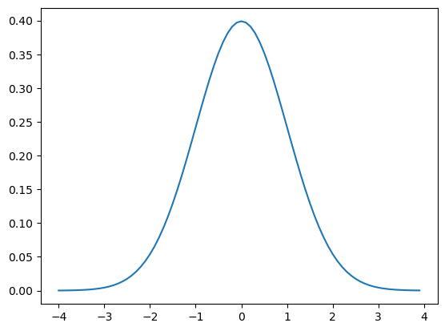
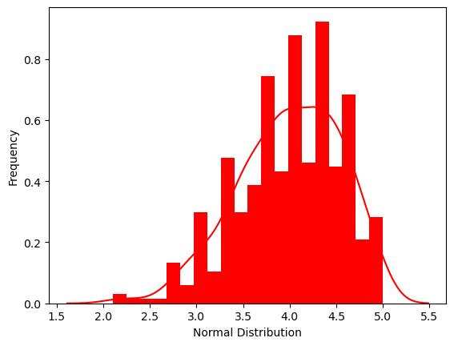
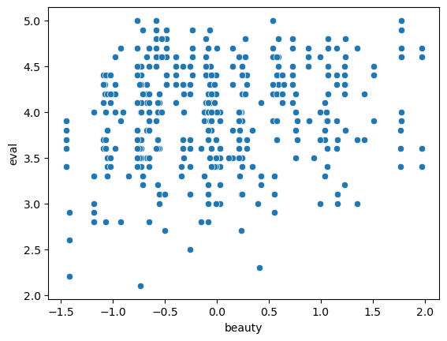

# 6. Estadística avanzada con Pandas

## 1. Introducción a la Distribución de Probabilidades

Contenido basado en Coursera: IBM

Usaremos nuevamente la base de datos del capítulo 5.


```python
import numpy as np
import pandas as pd
import matplotlib.pyplot as plt
import scipy.stats
from math import sqrt
import seaborn as sns
```


```python
URL = 'https://cf-courses-data.s3.us.cloud-object-storage.appdomain.cloud/IBMDeveloperSkillsNetwork-ST0151EN-SkillsNetwork/labs/teachingratings.csv'
```


```python
datos = pd.read_csv(URL)
```

### 1.1. Distribución normal


```python
from scipy.stats import norm

# Plot between -4 and 4 with 0.1 steps.
x_axis = np.arange(-4, 4, 0.1)
# Mean = 0, SD = 1.
plt.plot(x_axis, norm.pdf(x_axis, 0, 1))
plt.show()
```


    

    


#### Ejemplos

##### 1. Utilizando el conjunto de datos de calificación de los docentes, ¿cuál es la probabilidad de recibir una puntuación de evaluación superior a 4.5?

1. Encontrar la media y desviación estándar de la evaluación de los maestros. Redondear el resultado a tres decimales con **round**(*columna*, <code>mean/std</code>, *# de decimales*)


```python
eval_mean = round(datos['eval'].mean(), 3)
eval_sd = round(datos['eval'].std(), 3)
print(eval_mean, eval_sd)
```

    3.998 0.555
    

2. Encontrar la probabilidad, usando **scipy.stats** y **norm.cfd**, que es la función de distribución acumulada.
   - a) Calcular la diferencia entre 4.5 y la media de las evaluaciones
   - b) Estandarizar la diferencia: z = (4.5 - media) / desviación estándar
   - c) Calcular la distribución acumulada con norm.cfd
   - d) Calcular la probabilidad de recibir una puntiación de evaluación superior a 4.5 con: 1 - prob0


```python
prob0 = scipy.stats.norm.cdf((4.5 - eval_mean)/eval_sd)
print(1 - prob0)
```

    0.1828639734596742
    

##### 2. Utilizando el conjunto de datos de calificación de los docentes, ¿cuál es la probabilidad de recibir una puntuación de evaluación superior a 3,5 e inferior a 4,2?

1. Como ya tenemos la media y la desviación estándar, calcularemos directamente la diferencia con 3.5 y aplicaremos norm.cfd, para encontrar la probabilidad.


```python
prob1 = scipy.stats.norm.cdf((3.5 - eval_mean)/eval_sd)
print(prob1)
```

    0.1847801491443654
    

2. Ahora para 4.2.


```python
prob2 = scipy.stats.norm.cdf((4.2 - eval_mean)/eval_sd)
print(prob2)
```

    0.642057540461896
    

3. Y calculamos la diferencia:


```python
round((prob2 - prob1)*100, 1)
```


    45.7


### 1.2. Test de dos colas para una distribución normal

El escenario es el siguiente:

- Un equipo de baloncesto profesional quiere comparar su rendimiento con el de los jugadores de una liga regional.
- Se sabe que los profesionales tienen una media histórica de 12 puntos por partido con una desviación estándar de 5,5.
- Un grupo de 36 jugadores regionales registró una media de 10,7 puntos por partido.
- Al entrenador profesional le gustaría saber si los puntajes promedio de su equipo profesional son diferentes a los de los jugadores regionales.

Se proponen las siguientes hipótesis:

- H0 = La media de los jugadores regionales no difiere de la media histórica.
- H1 = La media de los jugadores regionales es diferente de la media histórica

Elementos:
- Media: 12
- Desviación estándar: 5.5
- Media de una muestra: 10.7
- Tamaño de la muestra: 36


```python
# Obtenemos el p-value usando norm.cdf.
# Como es un test de dos colas multiplicamos por 2
2*round(scipy.stats.norm.cdf((10.7 - 12)/(5.5/sqrt(36))), 3)
```


    0.156


Conclusión: Debido a que el valor de p es mayor que 0.05, no podemos rechazar la hipótesis nula ya que no hay evidencia suficiente para demostrar que el punto medio de los actores regionales sea diferente de la media histórica.

#### Ejercicios

##### Ejercicio 1:

Si obtuviste un 75 en una prueba en una clase con una puntuación media de 85 y una desviación estándar de 5, la puntuación z de tu puntuación en la prueba sería


```python
ejercicio = scipy.stats.norm.cdf((75 -85)/5)
print(ejercicio)
```

    0.022750131948179195
    


```python
z = (75-85)/5
z
```


    -2.0


##### Ejercicio 2:

Anualmente se realiza una prueba. La prueba tiene una puntuación media de 150 y una desviación estándar de 20. Si la puntuación z de Chioma es de 1,50, ¿cuál fue su puntuación en el examen? 


```python
# Despejando z = (valor - media) / desviación estándar
# valor = (z * desviación estándar) + media

1.50*20+150
```


    180.0


##### Ejercicio 3:

Las tortugas marinas verdes tienen pesos normalmente distribuidos, medidos en kilogramos, con una media de 134.5 y una varianza de 49.0. El peso de una tortuga marina verde en particular tiene una puntuación z de -2,4. ¿Cuál es el peso de esta tortuga verde? Redondea al número entero más cercano.


```python
# En este problema se da la varianza, para obtener la desviación estándar, es necesario calcular su raíz cuadrada
import math
math.sqrt(49)
```


    7.0


```python
-2.4*7+134.5
```


    117.7


## 2. Pruebas de hipótesis

El objetivo de la prueba de hipótesis es responder a la pregunta: "Dada una muestra y un efecto aparente, ¿cuál es la probabilidad de ver tal efecto por casualidad?". Los pasos a seguir son:
1. Cuantificar el tamaño del efecto aparente eligiendo una estadística de prueba (prueba t, ANOVA, etc.). 
2. Definir una hipótesis nula, que es un modelo del sistema basado en el supuesto de que el efecto aparente no es real.
3. Calcular el valor p, que es la probabilidad de que la hipótesis nula sea cierta.
4. Interpretar el resultado del valor p, si el valor es bajo, se dice que el efecto es estadísticamente significativo, lo que significa que la hipótesis nula. Puede que no sea exacto.

Seguimos usando la misma base de datos. Ahora usaremos el paquete de **scipy.stats.**

### 2.1. T-test

**Problema**: Utilizando el conjunto de datos de calificación de los docentes, ¿el género afecta las tasas de evaluación docente?

Para la prueba t independiente, se deben cumplir los siguientes supuestos.

- Una variable categórica independiente con dos niveles o grupo
- Una variable continua dependiente
- Independencia de las observaciones. Cada sujeto debe pertenecer a un solo grupo. No existe relación entre las observaciones de cada grupo.
- La variable dependiente debe seguir una distribución normal.
- Supuesto de homogeneidad de la varianza.

La hipótesis es la siguiente:
- H0: No hay diferencia en las puntuaciones de evaluación entre hombres y mujeres.
- H1: Existe una diferencia en las puntuaciones de evaluación entre hombres y mujeres.

1. Verificamos la distribución con un histograma:


```python
ax = sns.distplot(datos['eval'],
                  bins=20,
                  kde=True,
                  color='red',
                  hist_kws={"linewidth": 15,'alpha':1})
ax.set(xlabel='Normal Distribution', ylabel='Frequency')
## we can assume it is normal
```

    C:\Users\Mariana\AppData\Local\Temp\ipykernel_28556\2917810971.py:1: UserWarning: 
    
    `distplot` is a deprecated function and will be removed in seaborn v0.14.0.
    
    Please adapt your code to use either `displot` (a figure-level function with
    similar flexibility) or `histplot` (an axes-level function for histograms).
    
    For a guide to updating your code to use the new functions, please see
    https://gist.github.com/mwaskom/de44147ed2974457ad6372750bbe5751
    
      ax = sns.distplot(datos['eval'],
    C:\Users\Mariana\anaconda3\Lib\site-packages\seaborn\_oldcore.py:1119: FutureWarning: use_inf_as_na option is deprecated and will be removed in a future version. Convert inf values to NaN before operating instead.
      with pd.option_context('mode.use_inf_as_na', True):
    


    [Text(0.5, 0, 'Normal Distribution'), Text(0, 0.5, 'Frequency')]


    

    


2. Usamos la prueba de Levene para verificar la importancia de la prueba. Usamos **scipy.stats.levene** para tomar las puntuaciones de evaluación de mujeres y hombres como entradas y la opción center='mean' indica que se está centrando en la media para calcular la prueba.


```python
levene_test = scipy.stats.levene(datos[datos['gender'] == 'female']['eval'],
                                 datos[datos['gender'] == 'male']['eval'], center='mean')

# dado que el valor p es mayor que 0.05 podemos asumir igualdad de varianza
```


```python
# Si el valor p es mayor que 0.05, asumimos igualdad de varianzas
if levene_test.pvalue > 0.05:
    print("Podemos asumir igualdad de varianzas.")
else:
    print("No podemos asumir igualdad de varianzas.")
```

    Podemos asumir igualdad de varianzas.
    

Es importante recordar que la prueba de Levene es un paso preliminar relevante para asegurar que se están utilizando los métodos estadísticos correctos:
- Realizar la prueba de Levene para verificar la igualdad de varianzas.
- Dependiendo del resultado de la prueba de Levene:
  - Si las varianzas son iguales (p > 0.05), usar la prueba t estándar.
  - Si las varianzas no son iguales (p ≤ 0.05), usar la prueba t de Welch.


3. Ahora realizamos la prueba t de Student para comparar las medias de dos grupos independientes (hombres y mujeres).  Usamos **scipy.stats.ttest_ind** para tomar las puntuaciones de evaluación de mujeres y hombres como entradas y la opción equal_var=True indica que estamos asumiendo igualdad de varianzas (basado en el resultado de la prueba de Levene)


```python
scipy.stats.ttest_ind(datos[datos['gender'] == 'female']['eval'],
                   datos[datos['gender'] == 'male']['eval'], equal_var = True)
```


    TtestResult(statistic=-3.249937943510772, pvalue=0.0012387609449522217, df=461.0)


La prueba t proporciona un valor p que nos ayuda a determinar si hay una diferencia estadísticamente significativa entre las medias de los dos grupos. Si el valor p es menor que 0.05, rechazamos la hipótesis nula y concluimos que hay una diferencia significativa entre las medias de los grupos.

Conclusión: Dado que el valor p es menor que el valor alfa 0,05, rechazamos la hipótesis nula ya que hay pruebas suficientes de que existe una diferencia estadística en las evaluaciones docentes según el género.

### 2.2. ANOVA

**Problema**: Utilizando el conjunto de datos de calificación de los profesores, ¿la puntuación de belleza de los instructores difiere según la edad?

Primero, agrupamos los datos en categorías, ya que el ANOVA unidireccional no puede funcionar con variables continuas. Crearemos una nueva columna para este grupo recién asignado. Nuestras categorías serán profesores que son:

- 40 años y menos
- entre 40 y 57 años
- 57 años y más


```python
datos.loc[(datos['age'] <= 40), 'age_group'] = '40 years and younger'
datos.loc[(datos['age'] > 40)&(datos['age'] < 57), 'age_group'] = 'between 40 and 57 years'
datos.loc[(datos['age'] >= 57), 'age_group'] = '57 years and older'
```

Las hipótesis son:
- H0: Las tres medias de población son iguales.
- H1: Al menos una de las medias difiere.

1. Hacemos un test de Levene:


```python
levene_test_2 = scipy.stats.levene(datos[datos['age_group'] == '40 years and younger']['beauty'],
                   datos[datos['age_group'] == 'between 40 and 57 years']['beauty'], 
                   datos[datos['age_group'] == '57 years and older']['beauty'], 
                   center='mean')
```


```python
# Si el valor p es mayor que 0.05, asumimos igualdad de varianzas
if levene_test_2.pvalue > 0.05:
    print("Podemos asumir igualdad de varianzas.")
else:
    print("No podemos asumir igualdad de varianzas.")
```

    No podemos asumir igualdad de varianzas.
    

*Nota*: aunque no sean iguales, seguiremos con el ejercicio.

2. Creamos tres variables para separar las tres variables anteriores


```python
forty_lower = datos[datos['age_group'] == '40 years and younger']['beauty']
forty_fiftyseven = datos[datos['age_group'] == 'between 40 and 57 years']['beauty']
fiftyseven_older = datos[datos['age_group'] == '57 years and older']['beauty']
```

3. Corremos el ANOVA:


```python
f_statistic, p_value = scipy.stats.f_oneway(forty_lower, forty_fiftyseven, fiftyseven_older)
print("F_Statistic: {0}, P-Value: {1}".format(f_statistic,p_value))
```

    F_Statistic: 17.597558611010122, P-Value: 4.3225489816137975e-08
    

**Conclusión**: Dado que el valor p es inferior a 0,05, rechazaremos la hipótesis nula ya que existe evidencia significativa de que al menos una de las medias difiere.

### 2.3. Chi cuadrada

La prueba chi-cuadrada de independencia se utiliza para determinar si existe una asociación significativa entre dos variables categóricas.

**Problema**: Utilizando el conjunto de datos de calificación de los docentes, ¿existe una asociación entre la titularidad y el género?

Establecemos las hipótesis:
- H0: La proporción de docentes titulares es independiente del género.
- H1: La proporción de docentes titulares está asociada al género.

1. Creamos una tabla para resumir datos categóricos en una matriz, para ver cuántos profesores titulares existen por género:


```python
cont_table  = pd.crosstab(datos['tenure'], datos['gender'])
cont_table
```


<div>
<style scoped>
    .dataframe tbody tr th:only-of-type {
        vertical-align: middle;
    }

    .dataframe tbody tr th {
        vertical-align: top;
    }

    .dataframe thead th {
        text-align: right;
    }
</style>
<table border="1" class="dataframe">
  <thead>
    <tr style="text-align: right;">
      <th>gender</th>
      <th>female</th>
      <th>male</th>
    </tr>
    <tr>
      <th>tenure</th>
      <th></th>
      <th></th>
    </tr>
  </thead>
  <tbody>
    <tr>
      <th>no</th>
      <td>50</td>
      <td>52</td>
    </tr>
    <tr>
      <th>yes</th>
      <td>145</td>
      <td>216</td>
    </tr>
  </tbody>
</table>
</div>


2. Ahora realizamos el test de chi cuadrada usando **scipy.stats.chi2_contingency**. Usamos False en correction, que indica que no se aplicará la corrección de Yates. Si la tabla de contingencia no es de 2x2 o si no se desea aplicar esta corrección, este es el ajuste correcto.


```python
scipy.stats.chi2_contingency(cont_table, correction = False)
```


    Chi2ContingencyResult(statistic=2.557051129789522, pvalue=0.10980322511302845, dof=1, expected_freq=array([[ 42.95896328,  59.04103672],
           [152.04103672, 208.95896328]]))


**Conclusión**: dado que el valor p es mayor que 0,05, no podemos rechazar la hipótesis nula, no hay pruebas suficientes de que los docentes sean contratados por motivos de género.

### 2.4. Correlación

**Problema**: Utilizando el conjunto de datos de calificación de los docentes, ¿se correlaciona la puntuación de la evaluación docente con la puntuación de belleza?

Establecemos las hipótesis:
- H0: La puntuación de la evaluación docente no se correlaciona con la puntuación de belleza.
- H1: La puntuación de la evaluación docente se correlaciona con la puntuación de belleza.

Como son variables continuas, podemos hacer una correlación de Pearson, usamos **sns.scatterplot** para visualizar los datos y **stats.pearsonr** para realizar el test:


```python
ax = sns.scatterplot(x="beauty", y="eval", data=datos)
```


    

    


```python
scipy.stats.pearsonr(datos['beauty'], datos['eval'])
```


    PearsonRResult(statistic=0.18903909084045212, pvalue=4.247115419813499e-05)


**Conclusión**: Dado que el valor p (Sig. (2 colas) < 0,05, rechazamos la hipótesis nula y concluimos que existe una relación entre la belleza y la puntuación de la evaluación docente.

#### Ejercicios:

##### Ejercicio 1:


Los ingresos semanales de los conductores de autobuses se distribuyen normalmente con una media de 395 dólares. Si sólo el 0,84% de los conductores de autobús tienen un ingreso semanal de más de $429,35, la desviación estándar de los ingresos semanales de los conductores de autobús es aproximadamente

Datos:
- Media = 395
- z = 2.3 (0.84 corresponde a una probabilidad de 0.9916 en la tabla de valores de z)
- valor = 429.35


```python
# Despejando z = (valor - media) / desviación estándar
# desviación estándar = (valor - media) / z

de = (429.35-395) / 2.3
de
```


    14.934782608695663


##### Ejercicio 2:

Para las siguientes muestras, asumimos que siguen una distribución normal y asumimos una varianza igual, nos gustaría saber si existe una diferencia entre las medias de ambas muestras. Si realizamos una prueba t de dos muestras para muestras independientes. ¿Cuál es el valor p para las estadísticas de la prueba?

Muestra1 = 9, 11, 10,11,10,12, 9,11,12, 9, 10

Muestra2 = 10, 13, 10, 13, 12, 9, 11, 12, 12, 12, 13


```python
# 1. Creamos una lista para las muestras

muestra1 = [9, 11, 10,11,10,12, 9,11,12, 9, 10]
muestra2 = [10, 13, 10, 13, 12, 9, 11, 12, 12, 12, 13]
```


```python
# Calculamos la t de Student con scipy.stats.ttest_ind
```


```python
scipy.stats.ttest_ind(muestra1, muestra2, equal_var=True)
```


    TtestResult(statistic=-2.2164816032790386, pvalue=0.03841461541539729, df=20.0)


##### Ejercicio 3:

Si quisiera probar la asociación mediante la prueba de chi-cuadrado, si existe una asociación entre el género (masculino o femenino) y la tenencia (titular o no), ¿cuál será mi grado de libertad?


```python
cont_table  = pd.crosstab(datos['tenure'], datos['gender'])
cont_table
```


<div>
<style scoped>
    .dataframe tbody tr th:only-of-type {
        vertical-align: middle;
    }

    .dataframe tbody tr th {
        vertical-align: top;
    }

    .dataframe thead th {
        text-align: right;
    }
</style>
<table border="1" class="dataframe">
  <thead>
    <tr style="text-align: right;">
      <th>gender</th>
      <th>female</th>
      <th>male</th>
    </tr>
    <tr>
      <th>tenure</th>
      <th></th>
      <th></th>
    </tr>
  </thead>
  <tbody>
    <tr>
      <th>no</th>
      <td>50</td>
      <td>52</td>
    </tr>
    <tr>
      <th>yes</th>
      <td>145</td>
      <td>216</td>
    </tr>
  </tbody>
</table>
</div>


```python
scipy.stats.chi2_contingency(cont_table, correction = False)
```


    Chi2ContingencyResult(statistic=2.557051129789522, pvalue=0.10980322511302845, dof=1, expected_freq=array([[ 42.95896328,  59.04103672],
           [152.04103672, 208.95896328]]))


##### Ejercicio 4:

Considere un conjunto de datos distribuidos normalmente con media μ = 63,18 pulgadas y desviación estándar σ = 13,27 pulgadas. ¿Cuál es la puntuación z cuando x = 91,54 pulgadas? (A 3 decimales).

Datos:
- Media = 63.18
- Desviación estándar = 13.27
- Valor x = 91.54


```python
z = (91.54-63.18)/13.27
round(z, 3)
```


    2.137


##### Ejercicio 5:

El contenido mineral de una marca particular de pastillas de suplemento se distribuye normalmente con una media de 490 mg y una varianza de 400. ¿Cuál es la probabilidad de que una pastilla seleccionada al azar contenga al menos 500 mg de minerales?

Datos: 
- Media = 490
- Varianza = 400
- Valor X = 500


```python
# 1. Calculamos primero Z:

z = (500-490)/math.sqrt(400)
z
```


    0.5


```python
# Calculamos la probabilidad

ejercicio = 1 - scipy.stats.norm.cdf(z)
ejercicio
```


    0.3085375387259869


##### Ejercicio 6:

El tiempo X que tarda un cajero en el carril rápido de una tienda de comestibles para completar una transacción sigue una distribución normal con media de 90 segundos y desviación estándar de 20 segundos. ¿Cuál es el primer cuartil de la distribución de X (en segundos)?


```python
mean = 90
std = 20
Q1 = scipy.stats.norm.ppf(0.25, mean, std)
Q1
```


    76.51020499607837


##### Ejercicio 7:

The average hourly wage at a fast-food restaurant is $5.85 with a standard deviation of $0.35. Assume that the wages are normally distributed. The probability that a selected worker earns more than $6.90 is


```python
mean = 5.85
std = 0.35
z = (6.90 - mean) / std
p = 1 - scipy.stats.norm.cdf(z)
p
```


    0.0013498980316301035


```python

```
